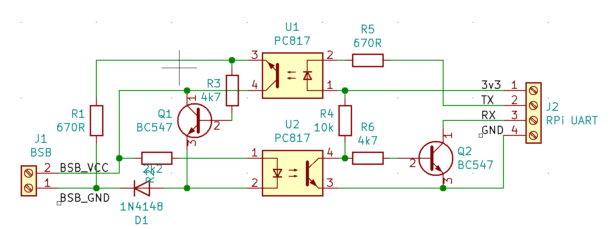

# BSB Controller

BSB Controller is a tool designed for configuring and monitoring the BSB-featured boilers via MQTT.
It is suited for Baxi Luna Platinum boilers, but will work with any other BSB based boilers.

## Features

- **Boiler configuration and monitoring**
- **Home Assistant integration**: MQTT integration featuring HA MQTT discovery for seamless configuration
- **Debug Monitoring Interface**: Simple get/set/log interface through HTTP/JSON.
- **Configurable and expandable**: User-selectable messages and period for their refresh
- **Minimal hardware required**: Python-enabled system with serial port and simple hardware adapter / voltage level convertor

## Getting Started

### Prerequisites

- Python 3.x
- MQTT broker (e.g., Mosquitto)
- Home Assistant (optional)
- System with serial port capable sending parity bits.
- Hardware adapter for serial port


## Hardware adapter



The hardware adapter is composed of:

1. two opto-couplers for galvanic separation (RX, TX);
2. 1 NPN transistor for shorting BSB line on transmission (pull-up is in the boiler);
3. 1 NPN transistor for level invertion + shorting RX pin of serial port (pull-up should be set in serial port);
4. some passive resistors and diode to get the right voltage levels.

The adapter can be built on the universal PCB.

Check the intended serial port for Parity mode support - for example HW serial ports of some RPi's are not capable of the Parity mode.
In this case one can use a USB-Serial adapter or use directly some USB-enabled microcontroller (e.g. Seeeduino XIAO) programmed as serial port.

Before connecting, check the voltage polarity on BSB pins. Ensure to connect data pin, not the panel backlight pin (both can have 12-15V in the bus idle state).

### Installation

1. **Prepare and connect the hardware adapter**

2. **Clone the repository**

   ```bash
   git clone https://github.com/martinspinler/bsb-controller.git

3. **Install with dependencies**

   It's recommended to use a virtual environment:

   ```bash
   python3 -m venv venv-bsb
   source venv-bsb/bin/activate
   pip install ./bsb-controller/

4. **Configure the application**

   Edit example configuration in example.yaml file.
   At least the `bsbport` and the `mqtt.connection` has to be updated.

5. **Run the server**

   ```bash
   python -m bsbcontroller --config ./bsb-controller/example.yaml
    
   Check the console output for sent & received messages. You should see successfully transmitted messages.

   As the BSB is shared, when more devices transmitting at once, the packets are discarded for CRC mismatch and retransmitted in some time.
   So the occassional CRC errors and retransmitted messages are okay.

## HTTP/JSON interface

The debug web server is enabled by default (runs on port 8008).

HTTP GET request with empty query string outputs last messages in JSON.
HTTP GET request with the `get` query string reads one item over BSB and print current value. For example: `http://bsb-host:8008/?get=hc1_mode`
HTTP GET request with the `set` query string writes value of item over BSB. For example: `http://bsb-host:8008/?set=room1_temp_req&val=20.5`

## License
This project is licensed under the MIT License - see the [LICENSE](LICENSE) file for details.
